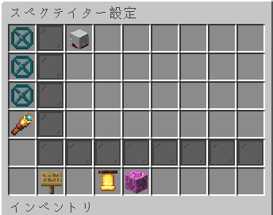
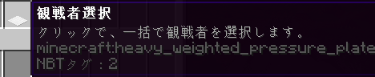
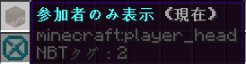
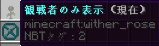
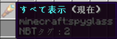
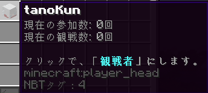
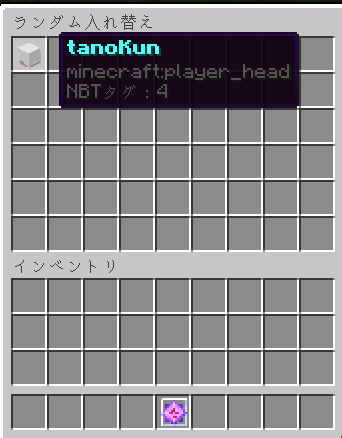

# JinrouSpecUtil
以下のようなGUI上で、人狼での観戦者管理を簡単にします。

## 機能
- [コマンドでのGUI](#GUI)
- [制限人数分のワンタップ観戦者選択](#ワンタップ観戦者)
- [観戦者選択法の変更](#選択モード変更)
- わかりやすいソート順
- [自動カウント](#プレイヤー情報)

## 選択モード変更
### 運ゲーモード
**最後の試合が観戦者ではなかった人**から観戦者を選択します。
連続した観戦の可能性は無いですが、__**参加数に開きが出てしまう可能性があります。**__

### 平等にモード
**試合参加数が多い順**に、観戦者を選択します。
参加数を平等にしやすいモードですが、新規が入ってきた場合、
__**連続した観戦の可能性が出てきます。**__

## GUI
`/spec` で開くGUI。使うパーミッションは`com.tanokun.github.spec`(デフォルト: OP)

### ワンタップ観戦者

このボタンをクリックしたときに、既に観戦者として選ばれている人がいる場合、
その観戦者は維持したまま、参加者から選択します。

### 参加者表示

GUI上にて、参加者となっている人を表示します。

### 観戦者表示

GUI上にて、観戦者となっている人を表示します。

### すべて表示

GUI上にて、観戦、参加関係なく表示します。

### プレイヤー情報

情報はこのままですが、「現在の○○数」が変化するときは、**__ゲームが開始されたとき__** です。
観戦として選ばれた瞬間ではないことに注意してください。

### ランダム入れ替え

クリックすることで選択でき、現在のモードに準じてランダムに入れ替えます。